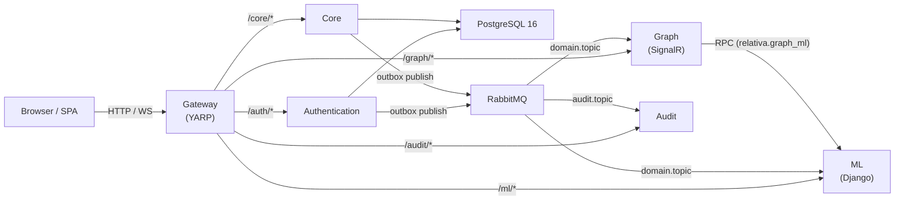
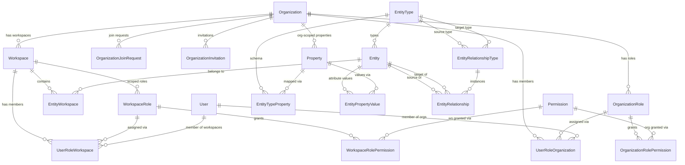
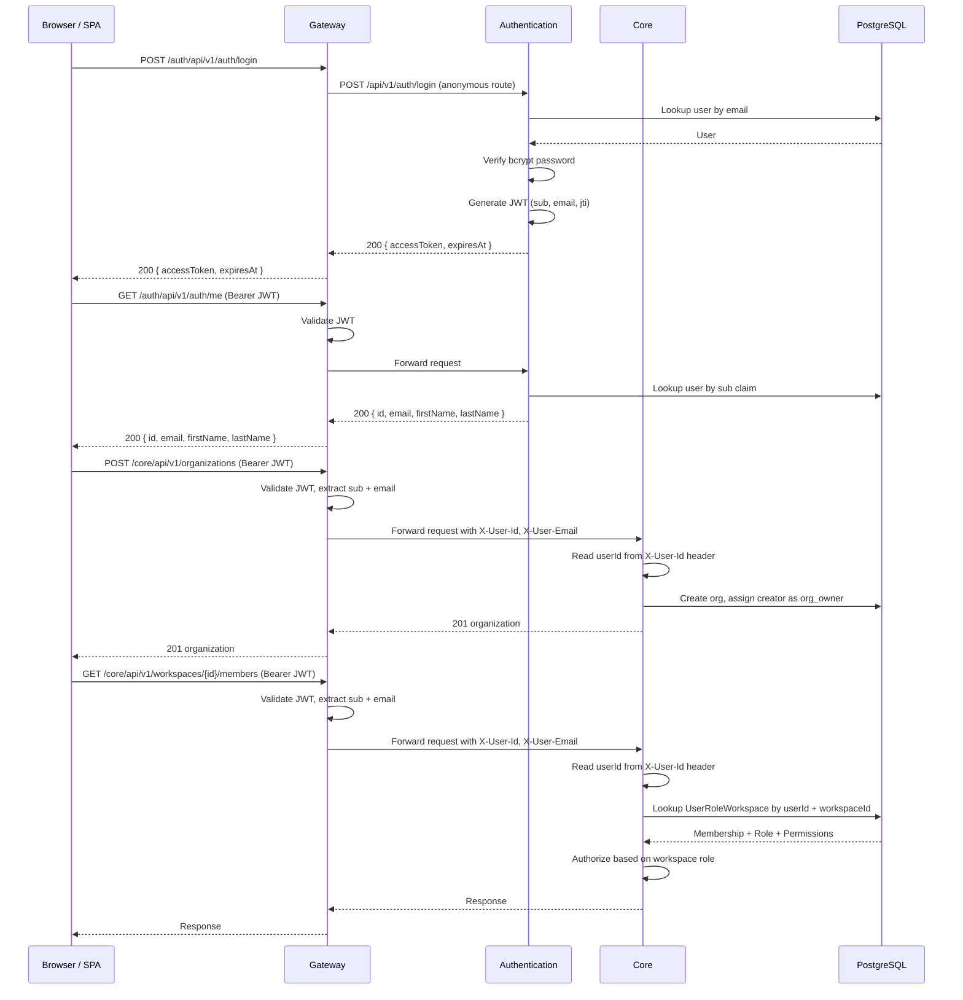

# Architecture -- Patterns, Layers, and Conventions

> **Last verified:** 2026-09-23 (Coding conventions: code style is defined once in the root `.editorconfig` and enforced by `dotnet format` in CI; Gateway exposes `public partial class Program` for its test host.)

> **Maintenance obligation:** If you change architecture patterns, add or modify a layer, alter the persistence model, change validation or auth flows, or introduce new cross-cutting concerns, update this file and its "Last verified" date before finishing your task. See [AI-GUIDES-INDEX.md](../../AI-GUIDES-INDEX.md) for the full update matrix.

---

## High-Level Architecture



All **browser** traffic flows through the **Gateway**. There is **no synchronous service-to-service HTTP**: backends do not call each other directly for domain work.

**Relativa.Messaging (`Messaging/src/Relativa.Messaging/`)** is a tiny shared helper library (.NET): `RabbitMqPublishingOptions`, `RabbitMqExchangeRouter`, and `OutboxRabbitMqPublisher` for declaring the audit/domain topic exchanges and opening AMQP connections. Core and Authentication **publish** audit + choreography rows from the transactional `audit_outbox` table; Audit, Graph, and ML **consume** asynchronously (see Inter-Service Communication).

---

## Layered / Clean Architecture

The project uses a **ports-and-adapters (Clean Architecture)** pattern. Each service that follows this pattern is split into four projects:

| Layer | Responsibility | Naming convention |
|---|---|---|
| **Host** | `Program.cs`, endpoint mapping, middleware | `Relativa.<Service>` |
| **Application** | Use cases, DTOs, validators, service interfaces/implementations | `Relativa.<Service>.Application` |
| **Domain** | Repository interfaces, service contracts, domain logic | `Relativa.<Service>.Domain` |
| **Infrastructure** | DbContext, EF repositories, external service implementations (JWT, bcrypt) | `Relativa.<Service>.Infrastructure` |

### Current state per service

| Service | Host | Application | Domain | Infrastructure |
|---|---|---|---|---|
| **Authentication** | Implemented | Implemented (AuthService, UserProvisioningService, DTOs, validators) | Implemented (interfaces only) | Implemented (AuthDbContext, repos, JWT, bcrypt) |
| **Core** | Implemented (org, workspace, member, invitation, role, join-request, permission, org-user-admin endpoints) | Implemented (+ `OrganizationUserAdminService`; references Authentication.Application for shared user writes) | Implemented (repository interfaces, IWorkspaceContext) | Implemented (RelativaDbContext, repos, WorkspaceContext, AuthDbContext + Auth repos for provisioning) |
| **Gateway** | Implemented | N/A (single project) | N/A | N/A |
| **Graph** | Implemented (SignalR hub + workspace choreography consumer + **HTTP entity-graph create** RPC client + **`GET /api/v1/graph`** RBAC-filtered graph query) | N/A (single project) | N/A | Two DbContexts: `GraphDbContext` (Rabbit idempotency) + `GraphQueryDbContext` (full read model for graph queries); Rabbit publish/reply for graph commands |
| **Audit** | Implemented (stub) | N/A (single project) | N/A | N/A |

Gateway, Graph, and Audit are single-project services with no layered split. When they grow, they should follow the same four-layer convention as Authentication.

### Dependency direction

```
Host → Application → Domain ← Infrastructure
                                    ↓
                              Persistence (shared)
```

- **Domain** defines interfaces; **Infrastructure** implements them.
- **Application** depends on Domain interfaces, never on Infrastructure directly.
- **Host** wires everything via DI and maps endpoints.
- All layers that need entities reference the shared **Persistence** library.

**Important caveat:** Domain interfaces return `Relativa.Persistence.Entities.*` types directly (e.g. `IUserRepository` returns `User`). This is a pragmatic coupling -- the domain layer is not isolated from the shared entity assembly.

---

## Data Modeling Conventions

### Third Normal Form (3NF)

All tables must satisfy **Third Normal Form**:

- **1NF**: no repeating groups, every column is atomic.
- **2NF**: all non-key attributes fully depend on the entire primary key.
- **3NF**: no transitive dependencies -- every non-key attribute depends on the key, the whole key, and nothing but the key.

**No denormalized columns.** Names, labels, and derived data are always resolved via JOINs, never duplicated across tables. This convention applies to all future schema changes.

---

## Shared Persistence Library

**Path:** `Persistence/src/Relativa.Persistence/`

This is a **.NET class library** (no solution, no runnable host) that holds the EF Core entity model shared across services. It is referenced via `ProjectReference` by Core, Authentication, Migration, and Graph. Graph now uses the full `ApplyAllEntityConfigurations()` in its `GraphQueryDbContext` to query users, workspaces, entities, and relationships for graph assembly.

**Related shared library:** `Messaging/src/Relativa.Messaging/` — RabbitMQ connection helpers reused by Authentication + Core infrastructure dispatchers.

### Contents

| Directory / File | What it contains |
|---|---|
| `Entities/` | Domain entities plus audit/outbox/choreography support types (see list below). |
| `Configurations/` | EF Fluent API `IEntityTypeConfiguration<T>` classes for each entity |
| `ModelBuilderExtensions.cs` | Extension methods: `ApplyAuthEntityConfigurations` (applies `UserConfiguration` and ignores the two direct navigation targets `UserRoleWorkspace` + `UserRoleOrganization` to prevent EF Core convention from discovering the full RBAC graph) and `ApplyAllEntityConfigurations` (full model for Core/Migration contexts) |

### Soft delete (`is_archived`) vs. uniqueness (users)

Several tables use `is_archived` instead of hard deletes for domain records. For **`users`**, email must stay unique among **active** accounts only: EF maps a **filtered** unique index on `email` with `HasFilter("\"is_archived\" = FALSE")`, and `IUserRepository.ExistsAsync` / `GetByEmailAsync` / `GetByIdAsync` treat archived rows as absent for registration and login. Archived rows remain for audit history; a new row may reuse the same normalized email after archive.

### Entity list (domain + infra)

| Entity | Table name | Notes |
|---|---|---|
| `User` | `users` | Credentials and profile. No `role_id` column (dropped). Partial unique index on `email` where `is_archived = false`. |
| `Organization` | `organizations` | Top-level tenant boundary. |
| `Workspace` | `workspaces` | Has `organization_id` FK (direct, no join table). |
| `WorkspaceSettings` | `workspace_settings` | One-to-one workspace settings. Columns: `high_risk_threshold`, `medium_risk_threshold`, `description` (varchar 500, nullable), `risk_scoring_enabled` (bool, default true). Unique on `workspace_id`. |
| `OrganizationSettings` | `organization_settings` | One-to-one org settings. Columns: `description` (varchar 500, nullable), `join_policy` (varchar 12, CHECK `'open'`\|`'invite_only'`, default `'open'`), `default_org_role_id` (nullable FK → `organization_roles`, SET NULL on role delete). Auto-seeded on org create. Unique on `organization_id`. |
| `OrganizationRole` | `organization_roles` | Org-scoped roles (system + custom). |
| `OrganizationRolePermission` | `organization_role_permissions` | Join between org roles and permissions. |
| `UserRoleOrganization` | `user_role_organization` | Org membership: user + org + org role. |
| `OrganizationJoinRequest` | `organization_join_requests` | Pending/approved/rejected requests to join an org. Partial unique index on `(organization_id, user_id) WHERE status='Pending'`. |
| `OrganizationInvitation` | `organization_invitations` | Email-based invitations to join an org, targeting a specific `OrgRoleId`. Partial unique index on `(organization_id, lower(email)) WHERE status='Pending'`. |
| `WorkspaceRole` | `workspace_roles` | Ws-scoped roles (system + custom). |
| `WorkspaceRolePermission` | `workspace_role_permissions` | Join between ws roles and permissions. |
| `UserRoleWorkspace` | `user_role_workspace` | Ws membership: user + workspace + ws role. |
| `Permission` | `permissions` | Shared by both org and ws role-permission joins. Org-scoped includes `manage_org_workspace_members`; workspace-scoped excludes removed `invite_to_workspace` / `manage_ws_join_requests`. |
| `EntityType` | `entity_type` | Named type discriminator (`client`, `deal`, `deal_analysis`, `contract`). Singular table name. |
| `Entity` | `entity` | Business record typed by EntityType. Singular table name. |
| `EntityWorkspace` | `entity_workspace` | Join between Entity and Workspace. Singular table name. |
| `Property` | `property` | **EAV.** Named attribute definition with data type (`String/Int/Decimal/Bool/Date`). `organization_id` nullable: `null` = global, set = org-specific custom property. |
| `PropertyAllowedValue` | `property_allowed_value` | **EAV constraint.** Optional enumeration of permitted string values for a `Property` of type `String`. Composite PK `(property_id, value)`. When rows exist for a property, `EntityService` validates submitted `ValueString` against this set on create and update (throws `ArgumentException` if not in the list). |
| `EntityTypeProperty` | `entity_type_property` | **EAV schema layer.** Maps which properties belong to which entity type, with `is_required` flag. Composite PK `(entity_type_id, property_id)`. |
| `EntityPropertyValue` | `entity_property_value` | **EAV data layer.** Stores a concrete attribute value for an entity. Composite PK `(entity_id, property_id)`. Five typed value columns: `value_string`, `value_int`, `value_decimal`, `value_bool`, `value_date`. Only one is populated per row. |
| `EntityRelationshipType` | `entity_relationship_type` | **EAV schema layer.** Directed link schema (source type → target type). Columns include `is_required` (outgoing obligation on **creates of the source type**) and `relationship_cardinality` (`one_to_one`, `one_to_many`, …) with optional partial unique indexes for one-to-one enforcement. |
| `EntityRelationship` | `entity_relationship` | **EAV data layer.** A concrete directed link between two entity instances, typed by `EntityRelationshipType`. |
| `EntityAuditLog` | `entity_audit_log` | Polymorphic audit log base class specialized for entities. Has `entity_id` and `changed_by` JSONB properties. |
| `WorkspaceAuditLog` | `workspace_audit_log` | Polymorphic audit log base class specialized for workspaces. |
| `UserAuditLog` | `user_audit_log` | Polymorphic audit log base class specialized for users. |
| `OrganizationAuditLog` | `organization_audit_log` | Polymorphic audit log base class specialized for organizations. |
| `AuditOutboxMessage` | `audit_outbox` | Pending + published payloads for transactional outbox (audit + choreography). |
| `AuditProcessedEvent` | `audit_processed_event` | Idempotency receipts for inbound audit payloads on the Audit consumer. |
| `RabbitMqProcessedDelivery` | `rabbitmq_processed_delivery` | Idempotency receipts for choreography consumers keyed by Rabbit `MessageId` + `consumer_group`. |

**Dropped in EAV migration:** `EntityProperty` (polymorphic hub), `PersonalDataPropertyValue`, `LocationPropertyValue`, `DealPropertyValue`. Their data is now stored as `EntityPropertyValue` rows. The deal→client association previously held as a FK in `DealPropertyValue.client_id` is now an `EntityRelationship` row of type `deal_client`.

**Table naming convention:** All entity-related tables use singular names (`entity_type`, `entity`, `entity_workspace`, `property`, etc.). Non-entity tables retain their original plural names (`users`, `organizations`, `workspaces`, etc.) and will be renamed in a future migration.

### Multiple DbContexts over one model

Different services compose **different slices** of the entity model:

| DbContext | Location | What it maps | Extension used |
|---|---|---|---|
| `AuthDbContext` | `Authentication/.../Infrastructure/Data/AuthDbContext.cs` | User only (other entities reachable via `User` navigation properties are cut with `Ignore<UserRoleWorkspace>()` + `Ignore<UserRoleOrganization>()`) | `ApplyAuthEntityConfigurations` |
| `RelativaDbContext` | `Core/.../Infrastructure/Data/RelativaDbContext.cs` | Full Persistence slice | `ApplyAllEntityConfigurations` |
| `MigrationDbContext` | `Migration/.../Data/MigrationDbContext.cs` | Full Persistence slice | `ApplyAllEntityConfigurations` |
| `GraphDbContext` | `Graph/.../Data/GraphDbContext.cs` | `RabbitMqProcessedDelivery` only (choreography idempotency) | `RabbitMqProcessedDeliveryConfiguration` only |
| `GraphQueryDbContext` | `Graph/.../Data/GraphQueryDbContext.cs` | Full Persistence slice — read-only queries for graph assembly (users, org/workspace RBAC, entities, relationships) | `ApplyAllEntityConfigurations` |

Migrations are owned by the **Migration** service. The migration assembly name is `Relativa.Migration`. Schema changes always go through `Migration/src/Relativa.Migration/Migrations/`.

### DbContext Ownership Matrix

This matrix defines which service is the **authoritative writer** for each table, to support future schema splitting:

| Table | Auth (read/write) | Core (read/write) |
|---|---|---|
| `users` | **Read/Write** (credentials) | Read-only (identity resolution) |
| `organizations` | -- | **Read/Write** |
| `organization_roles` | -- | **Read/Write** |
| `organization_role_permissions` | -- | **Read/Write** |
| `user_role_organization` | -- | **Read/Write** |
| `organization_join_requests` | -- | **Read/Write** |
| `organization_invitations` | -- | **Read/Write** |
| `workspaces` | -- | **Read/Write** |
| `workspace_settings` | -- | **Read/Write** |
| `organization_settings` | -- | **Read/Write** |
| `workspace_roles` | -- | **Read/Write** |
| `workspace_role_permissions` | -- | **Read/Write** |
| `user_role_workspace` | -- | **Read/Write** |
| `permissions` | -- | **Read/Write** |
| `entity_type` | -- | **Read/Write** |
| `entity` | -- | **Read/Write** |
| `entity_workspace` | -- | **Read/Write** |
| `property` | -- | **Read/Write** |
| `entity_type_property` | -- | **Read/Write** |
| `entity_property_value` | -- | **Read/Write** |
| `entity_relationship_type` | -- | **Read/Write** |
| `entity_relationship` | -- | **Read/Write** |

**Rules:**
1. Auth service must **never write** to any table other than `users`.
2. Core service must **never write** to password hashes or JWT-related User fields.
3. New workspace/org-related configurations go into `ApplyAllEntityConfigurations()` only -- they are **not** added to `ApplyAuthEntityConfigurations()`.

---

## Domain Model



**Key relationships:**

- **Organization is the primary multi-tenant boundary.** Users must join an organization before they can access workspaces within it.
- `Organization` → `Workspace` is a direct FK (`workspaces.organization_id`), not a join table.
- **Split RBAC schema:** Organization roles and workspace roles are separate table hierarchies that share a common `permissions` table.
  - **Org path:** `User` → `UserRoleOrganization` → `OrganizationRole` → `OrganizationRolePermission` → `Permission`
  - **Ws path:** `User` → `UserRoleWorkspace` → `WorkspaceRole` → `WorkspaceRolePermission` → `Permission`
- **Granular permissions** in the shared `permissions` table (ids are migration-defined; count changes with seeds):
  - **Org-scoped:** `manage_org_settings`, `invite_to_org`, `manage_join_requests`, `remove_org_members`, `assign_org_roles`, `manage_org_roles`, `create_workspaces`, **`manage_org_workspace_members`** (lets org admins add/remove users in any workspace of that org without workspace-scoped `add_ws_members` / `remove_ws_members`)
  - **Workspace-scoped:** `manage_ws_settings`, `add_ws_members`, `remove_ws_members`, `assign_ws_roles`, `manage_ws_roles`, `manage_entities`, `view_entities`, `view_analytics` (workspace email invitations and workspace join requests were removed)
- **7 default system roles:**
  - **3 org roles:** `org_owner` / `org_admin` include `manage_org_workspace_members`; `org_member` is minimal
  - **4 ws roles:** `ws_admin` (full workspace toolkit), `ws_manager` (subset incl. `add_ws_members`), `ws_analyst`, `ws_member`
- **Organization invitation / join-request flows:**
  - `OrganizationJoinRequest` — user-initiated; reviewed with `manage_join_requests`.
  - `OrganizationInvitation` — admin-initiated; targets `OrgRoleId`; non-default roles require `assign_org_roles`.
  - **Workspace membership:** Users are added via `POST /workspaces/{id}/members` (caller has `add_ws_members` on the workspace **or** `manage_org_workspace_members` on the parent org). No workspace invitation or workspace join-request tables.
  - **Dedup (org):** Partial unique indexes on pending org invitations / org join requests still apply as in migrations.
  - **Resend / expiry:** Org invitation resend + expiry handling unchanged (`POST …/organizations/{id}/invitations/{id}/resend`).
- `Entity` belongs to workspaces via `EntityWorkspace` and is typed by `EntityType` (`client`, `deal`, `deal_analysis`, `contract`). All entity types use the same EAV storage — there are no separate per-type tables.
- ML processing split:
  - Graph→ML scoring uses **RabbitMQ RPC** (`relativa.graph_ml` exchange). `RabbitMqMlScoringClient` (Graph) publishes and awaits reply; `run_graph_score_consumer` (ML) processes and replies.
  - `POST /api/ml/recalculate/` remains for manual/workspace-level recomputation via HTTP.
  - `run_recalculate_consumer` performs heavy write-back recomputation; `run_domain_consumer` marks freshness (`source_updated_at`) from Core domain events.
  - The `deal_analysis` entity type stores **ML feature cache** (derived columns: `days_since_created`, `avg_deal_value`, `num_interactions`, etc.). These are not source-of-truth data — they are refreshed by `run_recalculate_consumer` and validated for freshness via `source_updated_at`/`calculated_at` timestamps before scoring.
- **EAV two-level pattern:**
  - **Schema layer:** `EntityTypeProperty` defines which `Property` definitions belong to each `EntityType` (with `is_required`). `EntityRelationshipType` defines which entity type pairs can be linked (e.g. `deal_client`: deal → client).
  - **Data layer:** `EntityPropertyValue` holds a concrete typed value for one entity+property pair (composite PK). `EntityRelationship` holds a directed link between two entity instances, typed by `EntityRelationshipType`.
- **`Property` scoping:** `property.organization_id = NULL` means the property is global (system-wide); non-null means it is an org-defined custom property visible only to that organization.
- `OrganizationRole.OrganizationId` is **nullable** -- `null` for system roles, set for custom org-specific roles.
- **`organization_roles.priority`:** integer tier where **smaller = stronger** (seeded system roles: `org_owner` = 0, `org_admin` = 1, `org_member` = 6). Values are **not unique**. **Removing another member** (`remove_org_members` on `DELETE .../organizations/{id}/members/{userId}`) and **archiving another user** (`delete_org_users` on `DELETE .../organizations/{id}/users/{userId}`) require the caller's org role to **strictly outrank** the target (`callerPriority < targetPriority`; equal priority is forbidden). Self-removal from the org skips this check; self-archive through the org user-delete endpoint is rejected (use Authentication account settings / `DELETE /me`). Custom org roles set `priority` on create/update (minimum 1 — weaker than owner).
- `WorkspaceRole.WorkspaceId` is **nullable** -- `null` for system roles, set for custom workspace-specific roles.

---

## Validation Approach

Validation uses **FluentValidation** in the Application layer with explicit invocation in service methods.

### Flow

1. **Validator discovery:** `AddValidatorsFromAssemblyContaining<>()` in `Program.cs` registers all validators from the Application assembly via DI.
2. **Explicit validation:** Service methods call `validator.ValidateAndThrowAsync(request)` before any business logic.
3. **Exception mapping:** `GlobalExceptionHandler` middleware catches `ValidationException` and returns HTTP 400 with structured error details.

There is **no** global automatic validation filter or minimal-API endpoint filter. Validation is always explicitly called inside the application service.

### Validators implemented

**Authentication:**
- `LoginRequestValidator` -- in `Authentication/src/Relativa.Authentication.Application/Validators/`
- `RegisterRequestValidator` -- in `Authentication/src/Relativa.Authentication.Application/Validators/`

**Core:**
- `CreateWorkspaceRequestValidator`, `UpdateWorkspaceRequestValidator` -- workspace operations
- `InviteToOrgRequestValidator`, `AddWorkspaceMemberRequestValidator`, `ReviewJoinRequestRequestValidator` -- org invitations, workspace member add, org join-request review
- `CreateRoleRequestValidator` -- role management
- `UpdateMemberRoleRequestValidator` -- member management
- `CreateOrgUserRequestValidator`, `UpdateOrgUserProfileRequestValidator` -- org user admin provisioning / profile edits
- Organization-related validators for org CRUD, join requests, org invitations, org roles

### Convention for new services

When adding validation to a new service, follow the same pattern:
1. Create `*Validator` classes in the Application project using FluentValidation.
2. Register via `AddValidatorsFromAssemblyContaining<>()` in `Program.cs`.
3. Call `ValidateAndThrowAsync` in the service method.
4. Ensure `GlobalExceptionHandler` maps `ValidationException` to 400.

---

## Authentication and Authorization Flow



### JWT details

- **Issuing service:** Authentication (`JwtTokenService`)
- **Algorithm:** HMAC-SHA256 (symmetric key from `JWT_SECRET`)
- **Claims:** `sub` (user ID), `email`, `jti` (token ID). Role and permissions are **not** embedded in the JWT -- they are resolved per-request by Core using organization/workspace membership DB lookups.
- **Validation point:** Gateway validates issuer, audience, signing key, and lifetime. The Gateway is the **only** component that parses or validates JWTs for downstream services; Core/Graph/ML/Audit do not reference `Microsoft.AspNetCore.Authentication.JwtBearer` and have no `Jwt:*` configuration.
- **Authentication exception:** The Authentication service also validates its own tokens because its `/me` endpoint needs the claims from the JWT it just issued. That is the issuer's own job, not a duplication of gateway logic.
- **Audit exception:** Audit service has JWT registered but all validation checks disabled (stub).

### Internal identity propagation (Gateway → downstream)

After the Gateway validates the JWT, a YARP request transform copies the validated claims into trusted request headers before proxying:

| Header | Source claim | Consumed by |
|---|---|---|
| `X-User-Id` | `sub` | Core (all endpoint handlers via `WorkspaceEndpoints.GetUserId(HttpContext)`) |
| `X-User-Email` | `email` | Core (invitation accept flows via `WorkspaceEndpoints.GetUserEmail(HttpContext)`) |

**Trust boundary.** The transform **unconditionally removes** any incoming `X-User-Id` / `X-User-Email` on every proxied request before injecting its own values, so a client cannot spoof identity by sending these headers. The trust assumption is that downstream services are **not reachable from outside the Gateway's network** -- enforced today by `docker-compose.yml` (only the Gateway publishes a host port) and in production by network policy / service mesh. Downstream services treat a missing header as a deployment-level bypass and return 401.

### Organization-scoped authorization

Authorization for organization endpoints:
1. Core reads the user ID from the `X-User-Id` request header (injected by the Gateway after JWT validation).
2. Core looks up the `UserRoleOrganization` record for the user + organization pair, which includes the org role and its permissions.
3. Each org endpoint handler checks the required org permission before executing business logic.
4. Some endpoints only require org membership (e.g. listing members), while others require specific permissions (e.g. `manage_org_settings` to update org details).

### Workspace-scoped authorization

Authorization for workspace endpoints:
1. Core reads the user ID from the `X-User-Id` request header (injected by the Gateway after JWT validation).
2. Core looks up the `UserRoleWorkspace` record for the user + workspace pair, which includes the ws role and its permissions.
3. Each workspace endpoint handler checks the required ws permission before executing business logic.
4. Workspace creation requires the `create_workspaces` **org-scoped** permission in the target organization.

### Authorization policies

- **Gateway:** `MapReverseProxy().RequireAuthorization()` -- all proxied routes require a valid JWT unless explicitly marked anonymous in YARP route config. Auth routes are split: `/login` and `/register` are anonymous; `/me` (GET/PATCH/DELETE) requires JWT.
- **Audit:** `AuditReaders` requires a validated JWT. Read endpoints (`/audit-log`, `/entities/{id}/audit-log`) enforce **workspace** (`ws_admin` / `ws_analyst`) or **organization** (`org_owner` / `org_admin`) or **user-scope** rules via EF against `user_role_workspace` / `user_role_organization`. The read model joins `Entity`, `EntityType`, `Workspace`, `Organization`, `User`, and EAV `Property` / `EntityTypeProperty` metadata for report-friendly DTOs. See [AUDIT-LOG-API.md](AUDIT-LOG-API.md). Audit also consumes RabbitMQ events and persists into the four `*_audit_log` tables.
- **Core:** No ASP.NET authentication or authorization middleware. Identity comes exclusively from `X-User-Id` / `X-User-Email` headers (see "Internal identity propagation" above). Per-endpoint authorization is then enforced via `UserRoleOrganization` / `UserRoleWorkspace` DB lookups inside the application service layer.

---

## Inter-Service Communication

- **HTTP via Gateway only** for client-facing SPA traffic (no alternate client entry points).
- **Transactional outbox (`audit_outbox`)** inside Core + Authentication Postgres databases co-locates business writes with **pending RabbitMQ payloads**. Hosted dispatchers periodically publish to RabbitMQ and mark `published_at_utc`.
- **Three durable topic exchanges:**
  - **`audit.events`** — payloads whose routing keys use the **`audit.<scope>`** pattern (serialized `AuditEventContract`). Consumers: **Audit** (`audit.#`).
  - **`relativa.domain`** — choreography/domain payloads keyed off **`DomainRouting`** verbs (serialized `DomainMessageEnvelope` + typed `PayloadJson`). Consumers: **Graph** (workspace queue + SignalR broadcast), **ML** (`run_domain_consumer` + `run_recalculate_consumer` management commands).
  - **`relativa.graph_ml`** — RabbitMQ RPC for Graph→ML batch scoring. Graph publishes `MlScoreRpcRequestV1` with `ReplyTo` + `CorrelationId`; ML `run_graph_score_consumer` replies with `MlScoreRpcReplyV1`. 8 s timeout; graceful degradation (empty scores) on timeout or error. Contracts in `Persistence/Contracts/MlScoringRouting.cs`.
- **RPC pattern (request/reply):** Two paths use RabbitMQ RPC with exclusive auto-delete reply queues and correlation IDs:
  1. **Graph → Core entity create** (`relativa.entity_graph` exchange, `EntityGraphRouting.cs`)
  2. **Graph → ML batch scoring** (`relativa.graph_ml` exchange, `MlScoringRouting.cs`)
- **SignalR:** Graph pushes `domain.workspace.lifecycle.v1` to connected clients **after** idempotent ingestion from the choreography bus (`rabbitmq_processed_delivery` guards replays).
- **Shared envelopes / contracts:** `Persistence/src/Relativa.Persistence/Contracts/` defines `AuditEventContract`, `DomainMessageEnvelope`, `IOutboxWriter`, `EntityGraphRouting`, `MlScoringRouting`, and payload structs.
- **Operational runbook:** DLQ queues, purge commands, and configuration keys — [RABBITMQ-CHOREOGRAPHY.md](../runbooks/RABBITMQ-CHOREOGRAPHY.md).

---

## Cross-Cutting Concerns

| Concern | Implementation | Where |
|---|---|---|
| **Logging** | Serilog (console + rolling file) | Core, Authentication, Gateway |
| **Exception handling** | `IExceptionHandler` + `GlobalExceptionHandler` + `AddProblemDetails()`. Core maps: `ValidationException` → 400, `ArgumentException` → 400, `KeyNotFoundException` → 404, `UnauthorizedAccessException` → 401, `ForbiddenAccessException` → 403, `InvalidOperationException` → 409. Authentication additionally maps: `KeyNotFoundException` → 404, PostgreSQL unique violations (`DbUpdateException`) → 409. Audit adds `ForbiddenAccessException` → 403. Backend services serialize errors as `{ status, title, detail }` (validation `detail` is `"Field: msg; Field2: msg"`). In Core, organization permission denials now use `ForbiddenAccessException` (403), while auth identity failures remain 401. The Vue client consumes that envelope through `Client/src/api/errors.ts` (`normalizeError` → `NormalizedError` with status flags + parsed `fieldErrors`) and `Client/src/api/errorToast.ts` (`useApiErrorHandler().notify` for toast dispatch). Forms render `fieldErrors` inline under inputs; non-form failures are surfaced via toasts. | Core, Authentication, Gateway, Audit (distinct implementations per host) |
| **Health checks** | `/health` endpoint, EF Core DB checks on Auth and Core | All .NET services |
| **API docs** | OpenAPI + Scalar (`/scalar/v1`, `/openapi/v1.json`) | Auth, Core, Gateway, Graph (dev) |
| **CORS** | Gateway-only policy. Default: named-origin allowlist with credentials (`Cors:Origins`). Optional local dev override: `Cors:AllowAnyOriginForDev=true` enables wildcard origin without credentials. Downstream services do not apply local CORS policies to avoid drift. | Gateway |
| **Identity forwarding** | YARP request transform on every proxied request: strips any incoming `X-User-Id` / `X-User-Email`, then re-adds them from the validated `ClaimsPrincipal` (`sub` and `email` claims). Downstream services trust these headers and do not re-validate JWTs. | Gateway |
| **Forwarded headers** | `X-Forwarded-For`, `X-Forwarded-Proto` | Gateway |

---

## Coding Conventions

| Convention | Details |
|---|---|
| **API style** | Minimal APIs exclusively -- no MVC `[ApiController]` classes anywhere |
| **Endpoint organization** | Static extension methods (e.g. `AuthEndpoints.MapAuthEndpoints()`, `OrganizationEndpoints.MapOrganizationEndpoints()`, `WorkspaceEndpoints.MapWorkspaceEndpoints()`) |
| **DI lifetimes** | Scoped for repositories and application services; singleton for `IPasswordHasher` |
| **Configuration** | Options pattern (`Configure<JwtOptions>`) |
| **No `Startup.cs`** | All configuration in `Program.cs` (minimal hosting model) |
| **Target framework** | `net10.0` across all .NET projects |
| **Code style** | One root `.editorconfig` for all .NET code (per-service copies removed). `dotnet format --verify-no-changes` blocks CI on warnings: formatting, `using` order, braces (IDE0011), unused usings (IDE0005), naming (PascalCase types/public members/constants, `_camelCase` private fields, camelCase parameters/locals). EF `Migrations/` are treated as generated code. |
| **Test hosts** | Web services end `Program.cs` with `public partial class Program;` so tests can use `WebApplicationFactory<Program>` (Gateway, Graph, Audit). |
| **Package versioning** | Referenced in `Asp.Versioning.Http` (Authentication) but **not yet used** in code |
