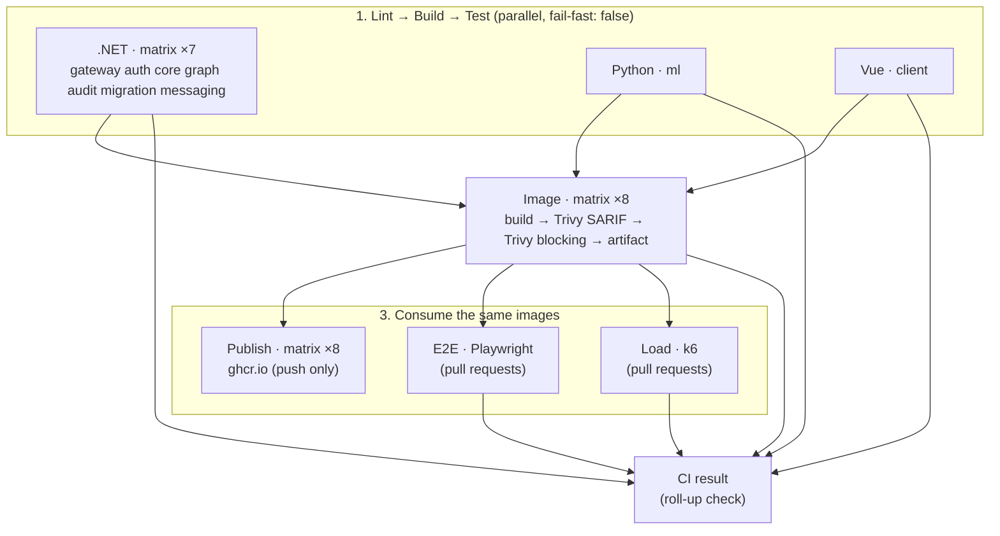

# CI Pipeline -- GitHub Actions, Images, Registry

> **Last verified:** 2026-10-08 (Release tags: `v*` git tags publish `<major>.<minor>.<patch>` image tags; `APP_VERSION` build arg; new Trivy findings fixed: Django 5.2, npm removed from the client runtime image.)

> **Maintenance obligation:** If you change `.github/workflows/`, `.github/actions/`, lint configuration (`.editorconfig`, `ML/pyproject.toml` Ruff section, `Client/eslint.config.js`), `.trivyignore`, `.dockerignore` files, or `docker-compose.images.yaml`, update this file and its "Last verified" date before finishing your task. See [AI-GUIDES-INDEX.md](../../AI-GUIDES-INDEX.md) for the full update matrix.

---

## Overview

**File:** `.github/workflows/ci.yaml` (single workflow, name `CI`).



**Build once, reuse everywhere.** Each image is built a single time in the `images` job, scanned, saved with `docker save` and uploaded as the artifact `image-<service>` (retention 1 day). `publish`, `e2e`, and `load` all `docker load` those exact bytes -- the image that passed Trivy and the system tests is the one that lands in the registry.

---

## Triggers

| Event | Branches | Jobs that run |
|---|---|---|
| `pull_request` (opened, synchronize, reopened, ready_for_review) | into `main`, `release/**` | stage 1, images, e2e + load (skipped for draft PRs), CI result |
| `push` | `main`, `feature/**`, `release/**` | stage 1, images, **publish**, CI result |
| `push` of a tag | `v*` (e.g. `v1.0.0`) | stage 1, images, **publish** (release image tags), CI result |
| `workflow_dispatch` | any | stage 1, images, e2e + load, CI result |

`concurrency` cancels superseded runs of the same PR; pushes are never cancelled (a publish must not be interrupted halfway).

---

## Stage 1 -- per-service jobs

Every job has separate **Lint**, **Build**, and **Test** steps. Matrix legs use `fail-fast: false`, and the three job families do not depend on each other, so one failing service never cancels the others.

| Check name | Lint (blocking) | Build | Test | Dependency cache |
|---|---|---|---|---|
| `.NET · <service>` | `dotnet format --verify-no-changes --severity warn --include <service folder>/` (rules: root `.editorconfig`) | `dotnet build -c Release` | `dotnet test` (xUnit; integration suites use Testcontainers -- Docker is available on `ubuntu-latest`) | `~/.nuget/packages`, key = hash of all `*.csproj` |
| `Python · ml` | `ruff check` + `ruff format --check` (config in `ML/pyproject.toml`) | `pip install -e .`, `compileall`, `manage.py check` | `manage.py test` against a throwaway `postgres:16-alpine` service container (trust auth, so no password lives in the workflow) | pip cache keyed on `ML/pyproject.toml` |
| `Vue · client` | `eslint .` (`Client/eslint.config.js`) + `vue-tsc --build` | `vite build` | `vitest run` | npm cache keyed on `Client/package-lock.json` |

.NET matrix entries and what they cover:

| Service | Project passed to `dotnet` | Lint scope | Tests |
|---|---|---|---|
| gateway | `Gateway/Relativa.Gateway.sln` | `Gateway/` | `Gateway/tests/Relativa.Gateway.Tests` (in-memory gateway + echo backend: JWT, prefix stripping, identity-header spoofing, CORS) |
| auth | `Authentication/Relativa.Authentication.sln` | `Authentication/` | Application tests |
| core | `Core/Relativa.Core.sln` | `Core/` | Application + Integration tests |
| graph | `Graph/Relativa.Graph.sln` | `Graph/` | Integration tests |
| audit | `Audit/Relativa.Audit.sln` | `Audit/` | Application + Integration tests |
| migration | `Migration/Relativa.Migration.sln` | `Migration/` `Persistence/` | `Migration/tests/Relativa.Migration.Tests` (EF model has no changes missing a migration; migrations ordered) |
| messaging | `Messaging/tests/Relativa.Messaging.Tests/*.csproj` | `Messaging/` | Router unit tests + RabbitMQ Testcontainers smoke test |

The shared `Persistence/` library is linted only by the `migration` job (it owns the schema), so a style issue there fails exactly one check.

**Testcontainers rule (keeps CI deterministic):** do not replace the module's wait strategy with `Wait.ForUnixContainer().UntilPortIsAvailable(5432)`. Postgres restarts once after `initdb`, so an open port can still answer `57P03: the database system is starting up`; the default `PostgreSqlBuilder` strategy waits for real readiness. All suites were switched to the default strategy for this reason.

### How lint results show up in a PR

- **.NET:** `setup-dotnet` registers a problem matcher for `IDExxxx` / `CSxxxx` diagnostics; `.github/problem-matchers/dotnet-format.json` adds one for the code-less ones (`WHITESPACE`, `IMPORTS`, `CHARSET`, `FINALNEWLINE`). Both become inline annotations on the PR diff.
- **Ruff:** `--output-format=github` writes annotations directly.
- **ESLint / vue-tsc:** `setup-node` registers the `eslint-stylish` and `tsc` matchers.
- **Vitest / Playwright:** the `github-actions` / `github` reporters annotate failing tests.

---

## Stage 2 -- images

Matrix over the compose services, using the Dockerfiles from the service folders:

| service | build context | Dockerfile |
|---|---|---|
| gateway | `Gateway` | `Gateway/Dockerfile` |
| auth | `.` | `Authentication/Dockerfile` |
| core | `.` | `Core/Dockerfile` |
| graph | `.` | `Graph/Dockerfile` |
| audit | `.` | `Audit/Dockerfile` |
| migration | `.` | `Migration/Dockerfile` |
| ml | `ML` | `ML/Dockerfile` |
| client | `Client` | `Client/Dockerfile` |

Steps: `docker/metadata-action` (tags + OCI labels) → `docker/build-push-action` (build arg `APP_VERSION` = metadata `version` output: the release version on tag pushes, `sha-<7>` otherwise; only the Gateway Dockerfile consumes it so far, see `GET /version`) with `load: true, push: false` and a per-service GitHub Actions layer cache (`type=gha,scope=image-<service>`) → Trivy SARIF report (never fails, uploaded to **Security → Code scanning**, category `trivy-<service>`) → **blocking Trivy scan** (`HIGH,CRITICAL`, `ignore-unfixed: true`, exit code 1) → `docker save | gzip` → artifact.

**Accepting a finding:** add the CVE id to `.trivyignore` with a comment explaining why, plus `exp:YYYY-MM-DD` so the scan blocks again after that date. Prefer bumping the package or base image instead. Currently accepted: the Go stdlib CVEs inside the client's esbuild 0.25 binary (dev/build-time tool, expires 2027-03-31).

Fixes already applied so every image passes the gate: `Microsoft.AspNetCore.OpenApi` 10.0.12 (pulls a patched `Microsoft.OpenApi`), `pip` removed from the ML runtime image, Django 5.2 LTS (≥ 5.2.17, CVE-2026-15307), npm removed from the client runtime image after `npm ci` (its bundled brace-expansion/undici were flagged), client dependencies refreshed with `npm update`.

**Build context hygiene:** every build context has a tracked `.dockerignore` (repo root, `Gateway/`, `Client/`, `ML/`) so host `bin/`, `obj/`, `node_modules/`, `.venv/`, and `.env` never reach an image.

---

## Stage 3a -- publish to GHCR

Runs only for `push` events (never for pull requests), after **all** image legs succeeded.

- Registry: `ghcr.io/<owner>/relativa-<service>` (owner lower-cased).
- Auth: `docker/login-action` with the built-in `GITHUB_TOKEN`; the job requests `packages: write`. No credentials are stored in the repository.
- Tags:
  - `sha-<7 chars>` -- every pushed commit, unique per build;
  - `latest` -- only when the push is to the default branch (`main`);
  - `<major>.<minor>.<patch>` -- only for a pushed git tag `v<major>.<minor>.<patch>` (`type=semver`), e.g. `v1.1.0` → `1.1.0`. These immutable release tags are what the Kubernetes manifests pin.

Cutting a release (the tagged commit must already contain this workflow):

```bash
git tag v1.1.0
git push origin v1.1.0
```
- The step summary lists every pushed tag.

Verify a published build locally:

```bash
IMAGE_TAG=latest docker compose -f docker-compose.yaml -f docker-compose.images.yaml pull
IMAGE_TAG=latest docker compose -f docker-compose.yaml -f docker-compose.images.yaml up -d
```

`docker-compose.images.yaml` resets the `build:` sections, so compose runs the registry images instead of building. `IMAGE_REGISTRY` defaults to `ghcr.io/totalbyte`. A fresh GHCR package is private by default: make it public in the package settings (or `docker login ghcr.io`) before pulling on another machine.

---

## Stage 3b -- system tests (pull requests)

Both jobs use the local composite action `.github/actions/start-stack`, which downloads all `image-*` artifacts, `docker load`s them, writes `.env` from `.env.example` plus `IMAGE_REGISTRY` / `IMAGE_TAG=sha-<7>`, and runs `docker compose -f docker-compose.yaml -f docker-compose.images.yaml up -d --wait`.

| Check name | Tool | Gate | Artifacts |
|---|---|---|---|
| `E2E · Playwright` | `tests/e2e` (Chromium, 1 retry in CI) | any failed spec | `playwright-report` (HTML + traces), `e2e-compose-logs` on failure |
| `Load · k6` | `tests/load/relativa.js`, smoke profile, 1 req/s per scenario (17 scenarios), 15 s | per-scenario `p(95) < 3000 ms` and error rate ≤ 5 % (k6 thresholds → non-zero exit) | `k6-report` (web dashboard HTML + JSON summary), `load-compose-logs` on failure |

The k6 script replaces the former NBomber project. `setup()` makes `WARMUP_ROUNDS` (default 3) untimed passes over the read endpoints first — without it, JIT/EF cold start pushed the heavy dashboard endpoints over the p95 gate on a freshly started stack. Run it locally against a running stack with `k6 run tests/load/relativa.js` (profiles: `smoke`, `ramp`, `spike`, `soak`; see the header of the script for all env vars). TestR's load suite runs the same script.

---

## Branch protection (GitHub → Settings → Branches → `main`)

- Require a pull request before merging (no direct pushes).
- Require status checks to pass, and "Require branches to be up to date before merging".
- Required checks (current setup): **every individual check** -- `.NET · gateway` … `.NET · messaging`, `Python · ml`, `Vue · client`, `Image · gateway` … `Image · client`, `E2E · Playwright`, `Load · k6` -- **plus** the roll-up `CI result`, which fails if any of those failed or was cancelled.
- Checks only appear in the picker after they ran at least once on a PR.
- Required approvals: **0** while the repository has a single maintainer -- GitHub does not let an author approve their own PR, so any approval requirement would block every merge. For the same reason keep "Require review from Code Owners" off unless `.github/CODEOWNERS` lists someone else with write access.
- Enable **"Do not allow bypassing the above settings"**. Without it, repository admins see a "bypass rules and merge" option, so a failing PR is not actually blocked for them.

### Check names are a contract (read before editing the workflow)

GitHub matches a required check **by its name only** -- the job's display name, e.g. `.NET · gateway`, built from `name: .NET · ${{ matrix.service }}`. It does not know which workflow job used to produce it. So any of these edits in `ci.yaml`:

- renaming a job's `name:` or changing its template,
- renaming or removing a `service` in a matrix,
- removing a job, or making the whole workflow skip PRs (e.g. a `paths:` filter in `on:`),

leaves the old name in the required list with nothing ever reporting it. Every PR then shows **"Expected — Waiting for status to be reported"** and cannot be merged; with bypassing disabled this also applies to admins. A job skipped through its `if:` (like `E2E` / `Load` on push) is different: it reports "skipped", which counts as passing.

**Fix:** in the same change, update Settings → Branches → `main` → required checks (remove the old names, add the new ones after they have run once on the PR). This lives outside the repository, so an agent must tell the user to do it.

**`CI result` moves the contract into `needs`.** When only `CI result` is required, renaming matrix entries or job display names is harmless -- but the job ids listed in `ci-result.needs` become the contract instead:

- a new gating job that is **not** added to `needs` is not enforced by `CI result` at all (it can fail and the PR still merges if it is not required on its own);
- a job id renamed or removed without updating `needs` makes the workflow invalid, so no check reports and every PR is blocked again;
- renaming `CI result` itself breaks the required check like any other name.

**Why `publish` is not in `needs`:** it runs only on push events and is always skipped for pull requests, so it can never be a merge criterion; it only delivers images that already passed every gate. Waiting for it would add nothing on PRs, and on pushes a registry outage would turn a verified commit red.

With the current setup (individual checks **and** `CI result`) both rules apply: keep the required list and `ci-result.needs` in sync with the jobs.

---

## Running the checks locally

| Stack | Command (from repo root unless noted) |
|---|---|
| .NET lint | `dotnet format <sln> --verify-no-changes` (drop `--verify-no-changes` to fix) |
| .NET tests | `dotnet test <sln>` (Docker needed for Testcontainers suites) |
| ML | `cd ML && pip install -e ".[dev]" && ruff check . && ruff format --check . && python manage.py test` (needs Postgres; `DB_*` env vars) |
| Client | `cd Client && npm ci && npm run lint && npm run type-check && npm run build-only && npm run test:unit` |
| Workflow syntax | `docker run --rm -v "$PWD:/repo" -w /repo rhysd/actionlint:latest` |

---

## Supply-chain rules for the workflow

- Every third-party action is pinned to a **full commit SHA** with the version in a trailing comment (`uses: owner/action@<sha> # vX.Y.Z`). Tags are mutable: in March 2026 76 tags of `aquasecurity/trivy-action` were force-pushed to credential-stealing commits (CVE-2026-33634). The pipeline uses `trivy-action` v0.35.0 (immutable release) with Trivy binary v0.69.3.
- `.github/dependabot.yml` bumps pinned SHAs weekly (one grouped PR).
- The workflow token defaults to `contents: read`; only `images` (`security-events: write`) and `publish` (`packages: write`) get more.
