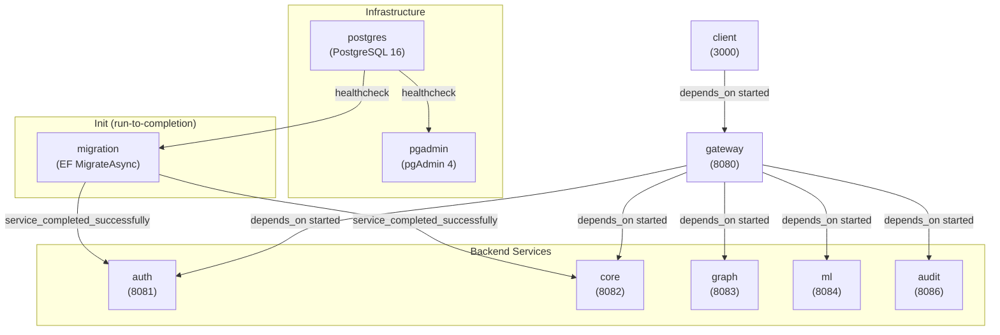

# Docker Setup -- Infrastructure and Deployment

> **Last verified:** 2026-10-07 (Gateway Dockerfile takes `ARG APP_VERSION` → `ENV APP_VERSION`; release image tags `<major>.<minor>.<patch>` usable as `IMAGE_TAG`.)

> **Maintenance obligation:** If you change Docker Compose, Dockerfiles, networking, volumes, or environment variables, update this file and its "Last verified" date before finishing your task. See [AI-GUIDES-INDEX.md](../../AI-GUIDES-INDEX.md) for the full update matrix.

> **Note:** For operational instructions (how to start/stop the stack, pgAdmin setup, troubleshooting), see [DOCKER-BUILD.md](../../DOCKER-BUILD.md) at the repo root. This guide explains the architectural "why" and "how things connect."

---

## Compose Topology

**Files:** `docker-compose.yaml` (full stack, builds images from the Dockerfiles) and the optional override `docker-compose.images.yaml` (same stack from prebuilt images, see [Running from prebuilt images](#running-from-prebuilt-images)).



---

## Service Dependency Order

The startup chain enforced by Docker Compose `depends_on` conditions:

1. **postgres** starts first. Has a `pg_isready` healthcheck.
2. **pgadmin** starts once postgres is healthy (ops tool, not an app dependency).
3. **migration** starts once postgres is healthy. Runs `Database.MigrateAsync()`, applies all EF migrations, then exits with code 0.
4. **auth** and **core** start once migration completes successfully (`service_completed_successfully`). Both need the schema to be ready.
5. **rabbitmq** starts and becomes healthy — required before **auth** and **core** (outbox dispatchers declare/publish exchanges).
6. **graph** starts after postgres + migration + rabbitmq (DB idempotency table + choreography consumer AMQP wiring).
7. **ml** starts after postgres + migration + rabbitmq (Postgres choreography inbox + Rabbit consumer sidecar alongside `runserver`).
8. **audit** starts after postgres + migration + rabbitmq.
9. **gateway** starts once auth, core, graph, ml, and audit are started (so YARP has upstream targets).
10. **client** starts once gateway is healthy (needs `VITE_GATEWAY_URL` to resolve).

---

## Network

- **Single bridge network:** `relativa_net` (`driver: bridge`)
- All services attach to this network, including RabbitMQ.
- **Internal DNS:** Services resolve each other by compose service name (e.g. `postgres`, `auth`, `core`). The Gateway's YARP cluster destinations are overridden in compose to use these DNS names (e.g. `http://auth:8081/`).

---

## Volumes

| Volume | Mount | Purpose |
|---|---|---|
| `postgres_data` (named) | `/var/lib/postgresql/data` on `postgres` | Persistent DB storage. Survives `docker compose down`. Destroyed by `docker compose down -v`. |

No other named or bind-mount volumes are defined. Service containers are stateless.

---

## Port Map

| Service | Container port | Host port | Notes |
|---|---|---|---|
| postgres | 5432 | `${DB_PORT}` (default 5432) | |
| pgadmin | 80 | `${PGADMIN_PORT}` (default 5050) | |
| auth | 8081 | 8081 | |
| core | 8082 | 8082 | |
| graph | 8083 | 8083 | |
| ml | 8084 | 8084 | |
| audit | 8086 | 8086 | |
| rabbitmq | 5672 | 5672 | AMQP broker for transactional outbox (audit pipeline + choreography domain exchanges) |
| rabbitmq-management | 15672 | 15672 | RabbitMQ management UI |
| gateway | 8080 | 8080 | Main entry point for clients |
| client | 3000 | `${CLIENT_PORT}` (default 3000) | |
| migration | -- | -- | No port (console app, exits after migration) |

---

## Dockerfiles

All Dockerfiles live in their respective service directories.

### .NET services (Auth, Core, Gateway, Graph, Audit, Migration)

Pattern: **multi-stage build**

| Stage | Base image | What it does |
|---|---|---|
| **build** | `mcr.microsoft.com/dotnet/sdk:10.0` | Restores NuGet, publishes in Release mode |
| **runtime** | `mcr.microsoft.com/dotnet/aspnet:10.0` | Copies published output, sets `ENTRYPOINT` |

**Build arg:** `Gateway/Dockerfile` declares `ARG APP_VERSION=dev` and exports it as `ENV APP_VERSION` (reported by `GET /version`). CI passes the release version; local `docker compose build` leaves it at `dev`.

**Exception:** Migration uses `sdk:10.0` as the runtime image (not `aspnet`) because it is a console host, not a web server.

### Build context details

Services that reference the shared `Persistence` library need the **repo root** as build context so the Dockerfile can `COPY` both the service directory and `Persistence/`:

| Dockerfile | Build context (in compose) | Copies Persistence? |
|---|---|---|
| `Authentication/Dockerfile` | `.` (repo root) | Yes (also copies `Messaging/` shared publish helpers) |
| `Core/Dockerfile` | `.` (repo root) | Yes (also copies `Messaging/` shared publish helpers) |
| `Migration/Dockerfile` | `.` (repo root) | Yes |
| `Gateway/Dockerfile` | `./Gateway` | No |
| `Graph/Dockerfile` | `.` (repo root) | Yes (`Persistence/` for choreography contracts + Postgres idempotency) |
| `Audit/Dockerfile` | `.` (repo root) | Yes |

### Build context filters (`.dockerignore`)

Each build context has a tracked `.dockerignore`, so host build output never reaches an image (Windows `obj/project.assets.json` or `node_modules` binaries copied into a Linux build break `dotnet publish` / Vite):

| Context | File | Excludes |
|---|---|---|
| `.` (auth, core, graph, audit, migration) | `.dockerignore` | `.git`, `.env*`, `**/bin`, `**/obj`, `**/TestResults`, `**/logs`, and folders no root-context Dockerfile copies (`Client/`, `ML/`, `Gateway/`, `tests/`, `docs/`, …) |
| `./Gateway` | `Gateway/.dockerignore` | `bin/`, `obj/`, `logs/`, `tests/` |
| `./Client` | `Client/.dockerignore` | `node_modules/`, `dist/`, `coverage/`, `.env*` |
| `./ML` | `ML/.dockerignore` | `.venv/`, `__pycache__/`, `.ruff_cache/`, `*.egg-info/`, `.env` |

### Non-.NET services

| Dockerfile | Base image | Notes |
|---|---|---|
| `ML/Dockerfile` | `python:3.12-slim` | Installs editable package, then uninstalls `pip` (not needed at runtime; its vendored packages were flagged by Trivy); **`scripts/run_api_and_consumer.sh`** runs `manage.py run_domain_consumer` concurrently with Django `runserver` |
| `Client/Dockerfile` | `node:22-alpine` | `npm ci`, then removes npm/npx from the image (not needed at runtime; its vendored packages were flagged by Trivy); runs `node_modules/.bin/vite --host 0.0.0.0 --port 3000` (dev server, see PROJECT-STATUS known issues) |

---

## Environment Configuration

### `.env.example` (repo root)

Template for Docker Compose variable substitution. Users copy to `.env` (gitignored).

| Variable | Used by | Purpose |
|---|---|---|
| `DB_NAME` | postgres, auth, core, migration, graph, ml | Database name |
| `DB_USER` | postgres, auth, core, migration, graph, ml | Database username |
| `DB_PASS` | postgres, auth, core, migration, graph, ml | Database password |
| `DB_PORT` | postgres | Host-exposed port |
| `PGADMIN_DEFAULT_EMAIL` | pgadmin | Admin email |
| `PGADMIN_DEFAULT_PASSWORD` | pgadmin | Admin password |
| `PGADMIN_PORT` | pgadmin | Host-exposed port |
| `CLIENT_PORT` | client | Host-exposed port |
| `VITE_GATEWAY_URL` | client | Gateway URL the SPA calls |
| `CORS_ORIGIN_1` | gateway | First allowed browser origin for gateway CORS allowlist |
| `CORS_ORIGIN_2` | gateway | Second allowed browser origin for gateway CORS allowlist |
| `CORS_ALLOW_ANY_ORIGIN_FOR_DEV` | gateway | Local dev-only wildcard CORS override (`true`/`false`) |
| `JWT_SECRET` | auth, gateway, audit | Shared symmetric signing key |
| `JWT_ISSUER` | auth, gateway, audit | Token issuer claim |
| `JWT_AUDIENCE` | auth, gateway, audit | Token audience claim |

| `IMAGE_REGISTRY` | `docker-compose.images.yaml` only | Registry namespace of prebuilt images (default `ghcr.io/totalbyte`) |
| `IMAGE_TAG` | `docker-compose.images.yaml` only | Image tag to run: `latest` (main), `sha-<7 chars>`, or a release version such as `1.0.0` |

### How env vars reach services

- **Docker Compose** injects environment variables into containers. Values come from `.env` via `${VAR}` substitution in `docker-compose.yaml`.
- **.NET services** read these as **configuration overrides** using the ASP.NET Core env-var convention: `ConnectionStrings__Default`, `Jwt__Secret`, `Jwt__Issuer`, `Jwt__Audience`, `Jwt__AccessTokenMinutes`.
- **Default values** live in each service's `appsettings.json` (localhost-friendly). Docker overrides them for the container environment.
- **Gateway YARP destinations** are overridden in compose: `ReverseProxy__Clusters__auth-cluster__Destinations__default__Address=http://auth:8081/` etc.
- **Gateway CORS policy** is configured by compose env overrides: `Cors__Origins__0`, `Cors__Origins__1`, and `Cors__AllowAnyOriginForDev`.
- **Client** reads `VITE_GATEWAY_URL` at build/dev time (Vite env prefix).

### Critical: JWT settings must match

The `JWT_SECRET`, `JWT_ISSUER`, and `JWT_AUDIENCE` values must be identical between the **auth** and **gateway** services. Auth issues tokens with these values; Gateway validates against them. A mismatch causes all authenticated requests to fail with 401.

---

## Compose Develop Watch

`docker compose watch` support: `migration` rebuilds when `./Migration` changes; `client` syncs `./Client/src` and `index.html` into the container (Vite hot reload) and rebuilds on `package.json` changes. Other services must be rebuilt manually (`docker compose up --build <service>`).

---

## Running from prebuilt images

`docker-compose.images.yaml` is an override that drops (`!reset`) the `build:` and `develop:` sections of the eight application services and points them at `${IMAGE_REGISTRY:-ghcr.io/totalbyte}/relativa-<service>:${IMAGE_TAG:-latest}`:

```bash
IMAGE_TAG=latest docker compose -f docker-compose.yaml -f docker-compose.images.yaml pull
IMAGE_TAG=latest docker compose -f docker-compose.yaml -f docker-compose.images.yaml up -d
```

CI uses the same override for the E2E and load jobs after `docker load`-ing the images built earlier in the run. Image names, tags, and the publish rules are described in [CI-PIPELINE.md](CI-PIPELINE.md).
